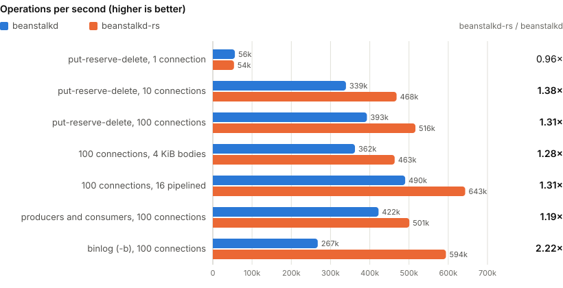

# beanstalkd-rs

[](https://github.com/shaunlee/beanstalkd-rs/actions/workflows/ci.yml)

`beanstalkd-rs` is a drop-in replacement for
[beanstalkd](https://github.com/beanstalkd/beanstalkd), the simple work
queue, written in Rust. It speaks the beanstalkd protocol byte for byte,
so existing clients work unmodified; it is faster with many connections, adds TLS and
monitoring, and can replicate the queue across a 3- or 5-node cluster.

**Status**: 0.5.0 is the first release; development phases P0 to P9 are
done. See [CHANGELOG.md](CHANGELOG.md) and the plan in
[docs/PLAN.md](docs/PLAN.md).

## Quick start

From source (Rust 1.98 or newer):

```sh
cargo build --release --locked -p bstk-server
./target/release/beanstalkd-rs -l 127.0.0.1 -p 11300 -b ./binlog
```

With Docker ([`shonhen/beanstalkd-rs`](https://hub.docker.com/r/shonhen/beanstalkd-rs)
on Docker Hub, linux/amd64 and linux/arm64; or `docker build -t beanstalkd-rs .`):

```sh
docker run -d -p 127.0.0.1:11300:11300 -v bstk-data:/data shonhen/beanstalkd-rs -l 0.0.0.0 -p 11300 -b /data
```

From a release archive (Linux x86_64 / aarch64, glibc or static musl;
macOS aarch64), on the
[releases page](https://github.com/shaunlee/beanstalkd-rs/releases):

```sh
sha256sum -c --ignore-missing SHA256SUMS
tar -xzf beanstalkd-rs-<version>-<target>.tar.gz
```

Each archive holds the binary, a systemd unit, example configurations,
the cluster certificate script and the operations guide. Installation
with systemd, configuration, clusters, backups, upgrades and monitoring:
[docs/OPERATIONS.md](docs/OPERATIONS.md).

## Performance

Operations per second, beanstalkd-rs against beanstalkd
(`25085c5`, built with `-O2`), both with default settings, on Linux 7.0
(aarch64) in an OrbStack VM on an Apple M6: servers on 6 cores, the
`bstk-bench` load generator on the other 6, loopback, 5 alternated runs
per cell, medians. 16-byte job bodies unless noted.

<picture>
  <source media="(prefers-color-scheme: dark)" srcset="docs/images/perf-dark.svg">
  
</picture>

| Workload | beanstalkd | beanstalkd-rs | |
|---|---:|---:|---:|
| put-reserve-delete, 1 connection | 56,176 | 53,943 | 0.96× |
| put-reserve-delete, 10 connections | 339,283 | 468,310 | **1.38×** |
| put-reserve-delete, 100 connections | 392,713 | 516,336 | **1.31×** |
| put-reserve-delete, 100 connections, 4 KiB bodies | 362,247 | 463,416 | **1.28×** |
| put-reserve-delete, 100 connections, 16 pipelined | 490,247 | 643,204 | **1.31×** |
| producers and consumers, 100 connections | 422,349 | 500,891 | **1.19×** |
| with a binlog (`-b`, default fsync), 100 connections | 267,391 | 594,148 | **2.22×** |

- **CPU**: 10–24% less CPU per operation at 10 and 100 connections (1.94
  against 2.55 µs at 100 connections). One connection is bound by
  round-trip latency, where beanstalkd-rs is 4% slower on Linux and
  equal on macOS.
- **Cluster** (3 nodes on the same machine, every operation committed by
  a majority before its reply): 316k operations per second through the
  leader and 236k through a follower at 100 connections with the data on
  tmpfs; on a disk, each commit waits for a durable fsync on a majority
  of the nodes and the disk's sync rate sets the limit (48k on the VM's
  volume).
- **Memory per job**: 249 against 219 bytes for small jobs (1.13×), equal
  for 4 KiB jobs.
- **macOS** (native, same machine): 1.2–1.4× at 10 and 100 connections,
  1.9× with a binlog, equal at one connection.

Every cell, the macOS run, the method and the raw data:
[docs/BENCH.md](docs/BENCH.md) ("README numbers").

## beanstalkd-rs and beanstalkd

| | beanstalkd | beanstalkd-rs |
|---|---|---|
| Protocol | the reference | every command, reply and edge case, checked against the reference by differential tests and real Python and Go clients |
| Command line | `-l -p -z -b -f -F -s -u -V -v` | the same, except `-u` (leave the user switch to the service manager) |
| Throughput, 10–100 connections | baseline | 1.2–1.4× ([Performance](#performance)) |
| Persistence | binlog | write-ahead log with the same fsync policies (`-b`, `-f`, `-F`); no reply before its change is logged; on a disk error it stops instead of carrying on without a log |
| Replication and failover | — | Raft cluster of 3 or 5 nodes over mutual TLS; clients connect to any node; keeps serving through the loss of a minority |
| Online cluster changes | — | add, remove, replace and move nodes, grow from 1 to 3 or 3 to 5 nodes while serving (`beanstalkd-rs cluster`) |
| TLS | — (needs a proxy such as stunnel) | built in: several listeners, each plaintext or TLS |
| Authentication | — | mutual TLS or a token per listener |
| Monitoring | `stats` commands | the same, plus `/healthz`, `/readyz`, Prometheus `/metrics` and JSON `/admin` |
| Configuration | command line | command line or a TOML file (`--config`, `--check-config`) |
| SIGTERM | killed | graceful: stops accepting, syncs the log, exits 0 |
| SIGUSR1 | drain mode | drain mode (cluster-wide in a cluster) |
| Threads | one | one, or two with TLS, a binlog or a cluster; `--threads N` |
| Memory safety | C | Rust, no `unsafe` code (`unsafe_code = "forbid"`) |
| Packages | distribution packages | release archives for Linux x86_64 and aarch64 (glibc or static musl) and macOS aarch64, with a systemd unit; a Docker image (`shonhen/beanstalkd-rs`) |

The few intentional behavior differences are listed in
[docs/COMPAT.md](docs/COMPAT.md); with no configuration file the server
behaves like the reference.

## Documentation

- [docs/OPERATIONS.md](docs/OPERATIONS.md): operations guide
- [docs/beanstalkd-rs.example.toml](docs/beanstalkd-rs.example.toml): every configuration key
- [docs/DESIGN.md](docs/DESIGN.md): architecture and design
- [docs/COMPAT.md](docs/COMPAT.md): differences from the reference beanstalkd
- [docs/BENCH.md](docs/BENCH.md): performance results
- [docs/PLAN.md](docs/PLAN.md): development, test and acceptance plan
- [CHANGELOG.md](CHANGELOG.md): changes per release

## License

MIT, see [LICENSE](LICENSE). beanstalkd itself is also MIT-licensed.
